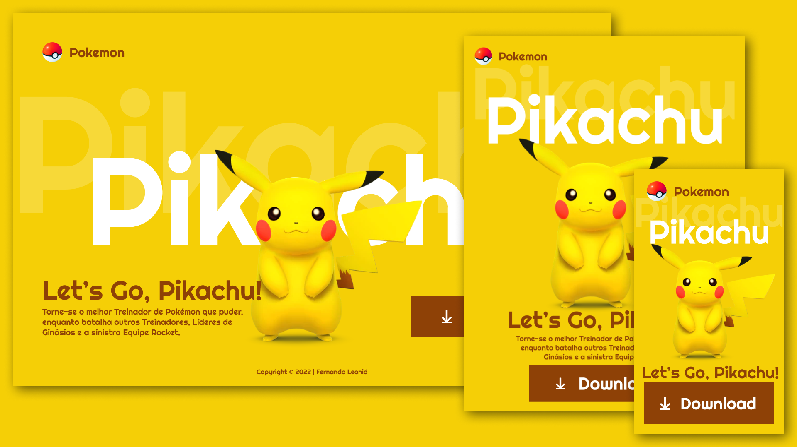

 # Landing Page - Let's Go, Pikachu

 

[Clique aqui](https://fernandoleonid.github.io/figma-to-website/05-pikachu/) para acessar o projeto.
 ---
 ## Sobre
 Site do tipo landing page para divulgar o jogo Let's Go, Pikachu.
 O intuito deste projeto é colocar em prática o conhecimento adquirido sobre as linguagens de marcação, HTML, CSS e Markdown.

 ---
 ## Tencologias utilizadas
 - HTML
 - CSS
 - Responsividade
 - Markdown

 ---
 ## Autor

 - [Fernando Leonid](https://github.com/fernandoleonid/)